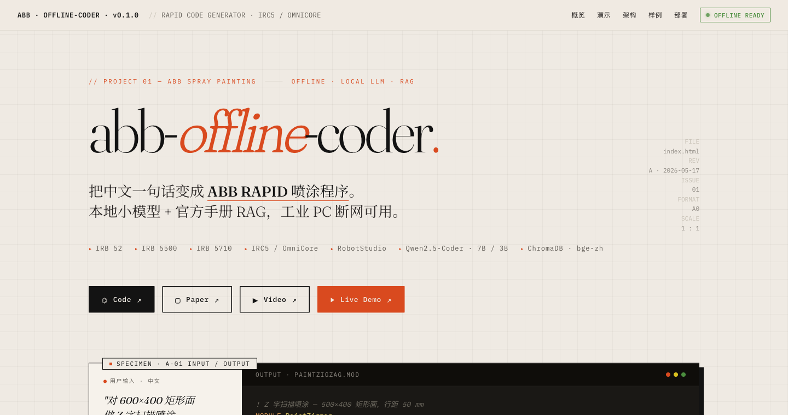
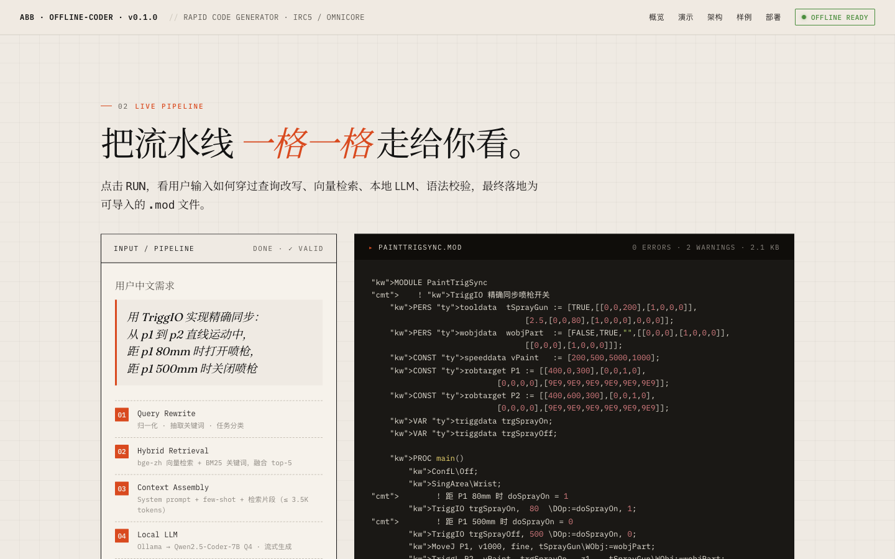
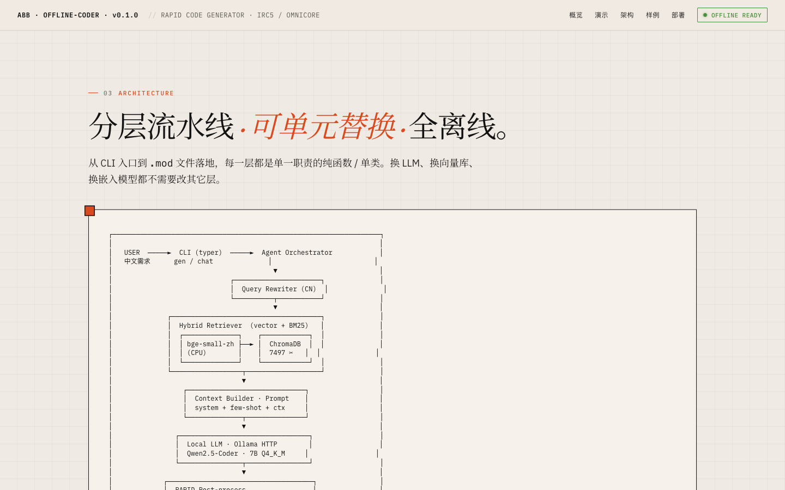
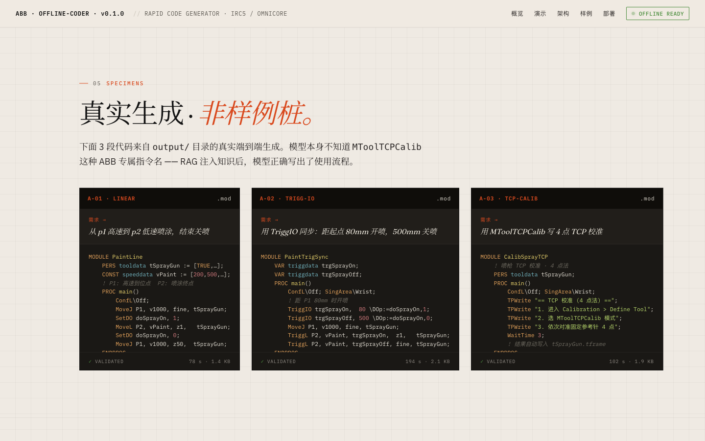
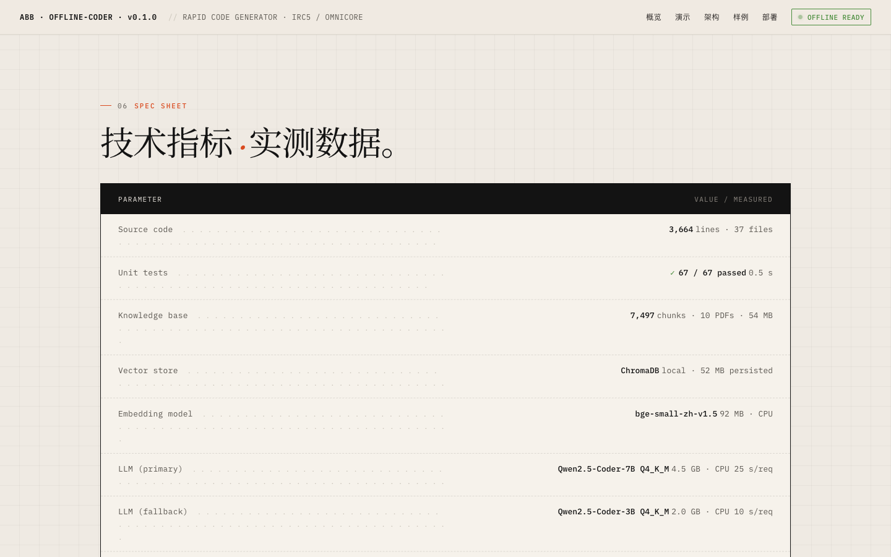
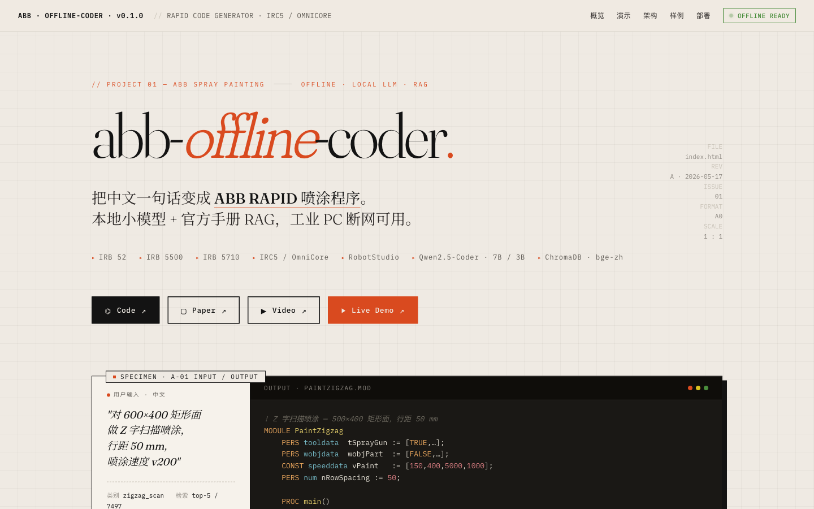

# abb-offline-coder

**离线 AI 编程助手 - 用中文描述需求，生成 ABB 喷涂机器人 RAPID 程序**

<a href="https://hollis36.github.io/abb-offline-coder/">
  
</a>

### 🌐 [访问项目演示页 → hollis36.github.io/abb-offline-coder](https://hollis36.github.io/abb-offline-coder/)

> 含交互式 Pipeline 演示、架构图、真实生成的 .mod 样本、性能规格表、安装指南。点上面截图直达。

[](https://hollis36.github.io/abb-offline-coder/)
[](https://github.com/Hollis36/abb-offline-coder)

[](https://opensource.org/licenses/MIT)
[](https://www.python.org/downloads/)
[](#testing)
[](https://hollis36.github.io/abb-offline-coder/)

---

## 演示页一览

<table>
  <tr>
    <td width="50%">
      <a href="https://hollis36.github.io/abb-offline-coder/#demo">
        
      </a>
      <div align="center"><b>02 · Live Pipeline</b><br><sub>6 步流水线动画 + 真实 .mod 流式输出</sub></div>
    </td>
    <td width="50%">
      <a href="https://hollis36.github.io/abb-offline-coder/#architecture">
        
      </a>
      <div align="center"><b>03 · Architecture</b><br><sub>分层流水线 ASCII 工程图</sub></div>
    </td>
  </tr>
  <tr>
    <td>
      <a href="https://hollis36.github.io/abb-offline-coder/#features">
        
      </a>
      <div align="center"><b>04 · Highlights</b><br><sub>9 个核心特性卡片</sub></div>
    </td>
    <td>
      <a href="https://hollis36.github.io/abb-offline-coder/#samples">
        
      </a>
      <div align="center"><b>05 · Specimens</b><br><sub>3 个真实生成的 .mod 样本</sub></div>
    </td>
  </tr>
  <tr>
    <td>
      <a href="https://hollis36.github.io/abb-offline-coder/#spec">
        
      </a>
      <div align="center"><b>06 · Spec Sheet</b><br><sub>实测性能数据 / 工程铭牌风格</sub></div>
    </td>
    <td>
      <a href="docs/screenshots/99-fullpage.jpeg">
        
      </a>
      <div align="center"><b>📜 Full page</b><br><sub><a href="docs/screenshots/99-fullpage.jpeg">点击查看 9302px 全页 JPEG</a></sub></div>
    </td>
  </tr>
</table>

---

> ⚠️ **免责声明**：本项目与 ABB Ltd. 无任何关联，不被 ABB 官方支持或认可。"ABB"、"RobotStudio"、"RAPID" 等均为 ABB Ltd. 商标。本工具是独立的第三方实用工具，仅用于辅助 RAPID 编程工作流。所有生成的代码必须在 RobotStudio 中**仿真验证**后才能上机，作者不对代码正确性或安全性承担任何责任。

在工业 PC / 现场调试电脑上**完全离线**运行的命令行 AI 助手，用中文描述需求即可生成符合 ABB 标准的 RAPID 程序（.mod 文件），可直接导入 RobotStudio。

## 核心特性

- **完全离线**：所有依赖（LLM、嵌入模型、向量库）本地运行，断网可用
- **中文自然语言**：用中文描述喷涂需求，自动生成 RAPID 代码
- **喷涂专精**：内置喷涂场景知识（笔刷工艺、TriggIO 同步、TCP 校准、Z 字扫描等）
- **双控制器模式**：通用 `IRC5`（MoveL + SetDO）与 `IRC5P`（PaintL/PaintC + brushdata 原生工艺）一键切换
- **Pack&Go 一键交付**：`--bundle` 模式直接产出含 `.mod` + `BASE.sys` + `T_ROB1.pgf` + README 的可加载目录
- **可演进**：RAG 知识库可不断追加新资料，模型可随硬件升级而升级
- **工业 PC 友好**：CPU 推理，无需独立 GPU，量化模型 4.5GB 内存即可

## 系统架构

```
用户中文需求
    ↓
查询改写 (中文→检索友好查询)
    ↓
RAG 混合检索 (向量 + BM25)
    ↓ 取 Top-K 知识片段
Prompt 装配 (system + few-shot + 检索上下文)
    ↓
本地 LLM 推理 (Ollama + Qwen2.5-Coder-7B)
    ↓
代码后处理 (MODULE 包裹 + 格式化 + 语法校验)
    ↓
.mod 文件输出 (可导入 RobotStudio)
```

## 快速开始

### 准备环境（有网工厂办公室）

```bash
git clone <repo> abb-agent
cd abb-agent

# 安装 Python 依赖 + Ollama
bash scripts/install.sh          # macOS / Linux
scripts\install.bat              # Windows

# 启动 Ollama 服务（保持开启）
ollama serve

# 拉取本地模型（首次约 4-6GB 下载）
python scripts/download_models.py

# 把 ABB 资料放入：
#   data/raw/pdf/    - RAPID Reference Manual / Application Manual 等
#   data/raw/code/   - 历史 .mod / .sys 示例代码
#   data/raw/html/   - 离线保存的 HTML 文档
python scripts/build_knowledge_base.py

# 体检
abb-agent doctor
```

### 离线部署 / 迁移到新设备（一键脚本）

在「已配置好的源设备」跑这一条命令，把整套环境（代码 + 模型 + 向量库 + 手册 + Python wheels）打成单文件：

```bash
bash scripts/bundle.sh           # macOS / Linux
scripts\bundle.bat               # Windows
```

零参数，自动收集**全部**：源码 / docs / 已下的 ABB PDF / ChromaDB 向量库 / bge 嵌入模型 / Ollama LLM 模型 / 离线 Python wheels；产出 `dist/abb-bundle-<日期>.tar.gz` 并附带 SHA256 校验。

把这个文件拷到新设备（Windows 工业 PC、Mac、Linux 都行），解压后**一行**还原：

```bash
tar -xzf abb-bundle-*.tar.gz && cd abb-bundle-*
bash restore.sh                  # macOS / Linux  (会自动用本地 wheels 离线装依赖
                                 #                + 合并 Ollama 模型 + 自检)
restore.bat                      # Windows
```

还原脚本内置 5 步：检查 Python ≥ 3.10 → 建 .venv 离线装依赖 → 合并 Ollama 模型到 `~/.ollama/models/` → 验证向量库 / 嵌入 → 给出 doctor + gen 演示命令。

如果只想做**精简打包**（无 Ollama 模型 / 无 wheels），仍可用旧的带参数版本：

```bash
bash scripts/package_offline.sh --skip-ollama --no-wheels
scripts\package_offline.bat /offline
```

### 使用 - 单次生成

```bash
abb-agent gen "对 600x400 矩形面做 Z 字扫描喷涂，行距 50mm，速度 v200"
```

输出：
- 终端展示生成的 RAPID 代码（语法高亮）
- 校验报告（错误/警告）
- 文件保存到 `output/PaintProgram_<时间戳>.mod`

### 使用 - 生成可直接上 IRC5P 的 Pack&Go 目录

```bash
abb-agent gen \
  --controller IRC5P \
  --strict-tcp \
  --bundle \
  -o output/MyPaintLine \
  "在 500x300mm 平板上 Z 字喷涂，行距 50mm"
```

会产出一个**完整可加载目录**：

```
output/MyPaintLine/
├── PaintProgram.mod   # PaintL/PaintC + brushdata（IRC5P 原生工艺）
├── BASE.sys           # 系统模块：Home 位 + 错误恢复 trap
├── T_ROB1.pgf         # XML 任务清单（控制器据此加载）
└── README.md          # 3 种加载方式 + 上线 4 步清单
```

**关键 flag**：

| Flag | 作用 |
|---|---|
| `--controller IRC5\|IRC5P` | 选择目标控制器；IRC5P 会启用 PaintL/PaintC 工艺校验、IO 白名单检查 |
| `--strict-tcp` | 若 tooldata 仍是默认占位 TCP `[0,0,200]` 则视为 error（上控制器前应开） |
| `--bundle` / `-b` | 输出 Pack&Go 完整目录，不只是单 `.mod` 文件 |

### 使用 - 多轮对话

```bash
abb-agent chat
```

```
你: 在车门外板做 Z 字扫描喷涂
助手: [生成代码...]

你: 把行距改成 30mm
助手: [基于上次代码修改...]

你: /save my_door_paint.mod
助手: 已保存到 output/my_door_paint.mod

你: /quit
```

## 配置

通过环境变量覆盖默认值（前缀 `ABB_AGENT_`）：

```bash
# 用更小的备用模型（弱配工业 PC）
export ABB_AGENT_LLM__MODEL_NAME="qwen2.5-coder:3b-instruct-q4_K_M"

# 调高温度增加多样性
export ABB_AGENT_LLM__TEMPERATURE=0.4

# 改用 GPU 推理（如果有）
export ABB_AGENT_EMBED__DEVICE="cuda"

# 全局切到 IRC5P 模式（持久；优先级低于命令行 --controller）
export ABB_AGENT_RAPID_CONTROLLER=IRC5P

# 用现场实际 IO 信号集覆盖默认白名单（JSON 数组字符串）
export ABB_AGENT_RAPID_IO_WHITELIST='["doSpray","doFan","doAtom","doColorA"]'
```

完整配置见 [abb_agent/config.py](abb_agent/config.py)。

## 控制器模式：IRC5 vs IRC5P

工具支持两种目标控制器，输出代码风格与校验规则不同：

| 维度 | `IRC5`（默认） | `IRC5P` |
|---|---|---|
| 适用控制器 | 通用 IRC5 / OmniCore，无 Paint 选项 | IRC5P / OmniCore Paint，含 RobotWare Paint (687-1) |
| 喷涂直线 | `MoveL` + `SetDO doSprayOn,1/0` | `PaintL target, speed, brushdata, zone, tool` |
| 喷涂圆弧 | `MoveC` + `SetDO` | `PaintC pMid, pEnd, speed, brushdata, zone, tool` |
| 工艺数据 | `PERS num` 占位 | `PERS brushdata` 原生类型 |
| 开关枪时序 | 用户手动 `SetDO` 配 `WaitTime` | brushdata 的 `preOpen` / `postClose` 自动管理 |
| 校验新增 | — | PNT001 (PaintL 缺 brushdata) / TCP001 (默认 TCP) / IO001 (白名单) |

切换方式：命令行 `--controller IRC5P` 单次覆盖，或 `export ABB_AGENT_RAPID_CONTROLLER=IRC5P` 持久化。

## 命令清单

| 命令 | 说明 |
|------|------|
| `abb-agent gen "需求"` | 单次生成 RAPID 代码（默认 IRC5 风格） |
| `abb-agent gen --controller IRC5P --bundle "需求"` | 生成可直接上 IRC5P 控制器的 Pack&Go 目录 |
| `abb-agent chat` | 多轮对话模式 |
| `abb-agent kb build` | 构建/增量更新知识库 |
| `abb-agent kb status` | 查看知识库状态 |
| `abb-agent kb inspect "查询"` | 测试检索质量 |
| `abb-agent kb clear` | 清空知识库 |
| `abb-agent init` | 首次安装引导（含控制器模式提示 + 上线清单） |
| `abb-agent doctor` | 健康检查（显示当前控制器、IO 白名单等） |
| `abb-agent version` | 显示版本 |

## 喷涂场景示例

输入需求 → 生成代码摘要（左 IRC5 默认 / 右 IRC5P 模式）：

| 需求示例 | IRC5 输出 | IRC5P 输出 |
|---------|------------------|------------------|
| "直线扫描，从 P1 到 P2" | `MoveL` + `SetDO doSprayOn` | `PaintL p, vPaint, bdMain, z10, tSprayGun` |
| "Z 字扫描，行距 50mm" | `FOR` + 交替 `MoveL` + `SetDO` | `MoveL` 定位 + `PaintL` 喷涂 |
| "圆弧轨迹喷涂" | `MoveC` + `SetDO` | `PaintC` + brushdata |
| "TriggIO 精确同步喷枪开关" | `TriggIO` + `TriggL` | brushdata 内部时序自动管 |
| "喷枪 TCP 校准 4 点法" | `TPWrite` 引导 + `ConfL\\Off` | 同左 |
| "增加流量调到 90%" | `PERS num nFlowRate := 90;` | `PERS brushdata bdMain := [90, ...]` |

## 项目结构

```
abb-agent/
├── abb_agent/
│   ├── config.py             # 全局配置
│   ├── agent.py              # 编排器
│   ├── cli/                  # CLI 入口与子命令
│   ├── knowledge/            # 知识库构建（爬虫/解析/切片）
│   ├── rag/                  # 检索 (向量/BM25/改写/装配)
│   ├── llm/                  # 本地 LLM 推理 + Prompt
│   └── rapid/                # 输出后处理（校验/模板/格式化）
├── scripts/                  # 安装、模型下载、打包脚本
├── data/                     # 资料 & 向量库（gitignored）
├── examples/                 # 示例 .mod 输出
├── tests/                    # 单元测试
└── docs/                     # 文档
```

## 资料收集建议

请用户在**有网环境**手动收集（避免抓取产生版权问题）：

1. ABB 官方 PDF 手册（library.abb.com）
   - `RAPID Reference Manual - Instructions, Functions`
   - `RAPID Reference Manual - RAPID Overview`
   - `Application Manual - Robotware-Paint / Paint Process`
   - 喷涂机型 Product Manual：IRB 52 / 5400 / 5500-25 / 5710 / 5720
2. 内部历史 RAPID 示例代码（.mod / .sys / .pgf）
3. RobotStudio 自带 RobotWare 示例（解压 `.rspag` 提取）
4. GitHub 上公开的 ABB RAPID 示例仓库（自行评估许可）

把资料放入对应目录后运行 `abb-agent kb build`。

## 验证 / 测试

```bash
# 安装开发依赖
pip install -e ".[dev]"

# 运行单元测试
pytest tests/unit -v

# 覆盖率（目标 80%+）
pytest tests/unit --cov=abb_agent --cov-report=term-missing
```

## 性能基准（工业 PC，i5 + 16GB RAM，无 GPU）

| 操作 | 预期时间 |
|------|---------|
| 知识库检索 (Top-5) | < 0.5s |
| LLM 推理（Qwen 7B Q4） | 15-30s |
| 后处理 + 校验 | < 0.2s |
| **端到端单次生成** | **20-35 秒** |

## 风险与限制

- 小模型对生僻 RAPID 指令的理解不完美，建议先用 `kb inspect` 检查检索质量
- 生成代码必须在 RobotStudio 中**仿真验证**后再导入实机
- 涉及安全的字段（速度、转弯区、TCP）**人工复核**不可省

## 路线图

- [x] v0.1：CLI + RAG + 喷涂 few-shot
- [x] v0.2：IRC5P 模式 — PaintL/PaintC + brushdata + Pack&Go bundle 输出
- [ ] v0.3：增加 IRB 5500 / 6700 等机型专门 few-shot
- [ ] v0.4：可选 GUI（基于 textual 或 web）
- [ ] v0.5：RAPID parser 提升校验深度
- [ ] v0.6：RobotStudio Add-In（C# 桥接）

## 许可证

[MIT License](LICENSE) - 任何人可自由使用、修改、分发本代码。

商标说明详见 [LICENSE](LICENSE) 文件。
